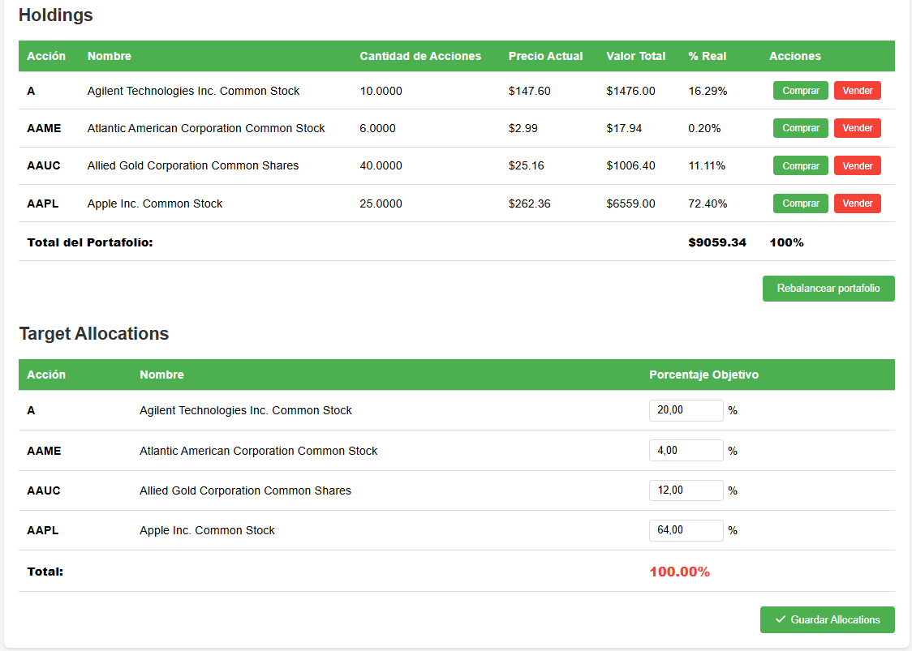
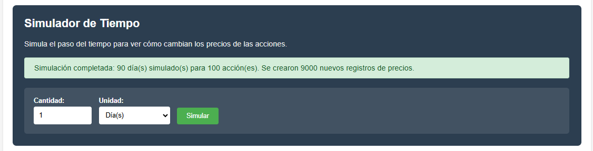
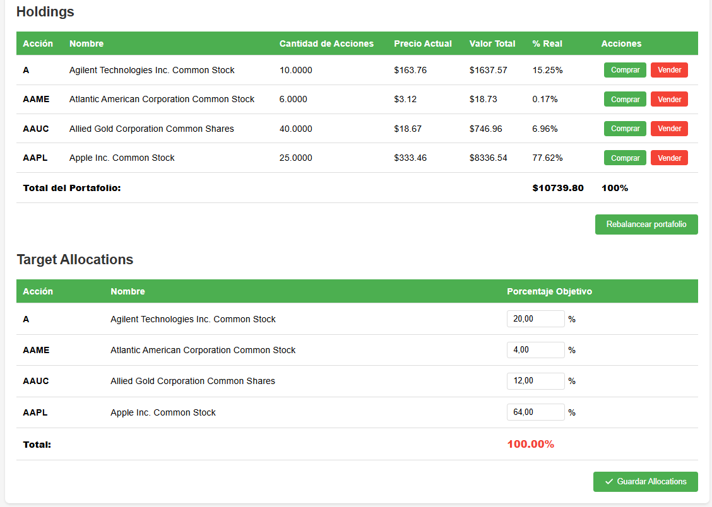
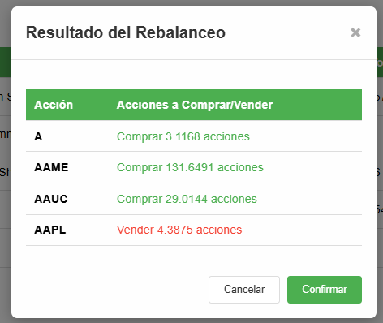
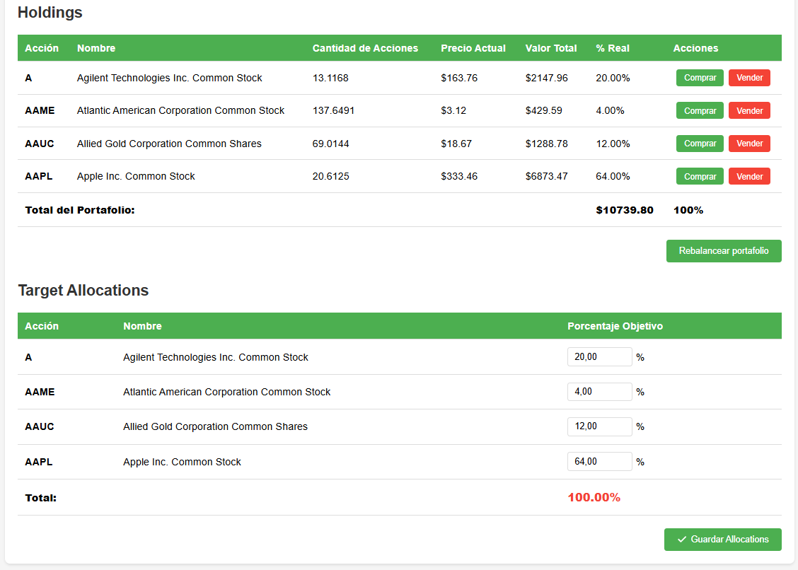
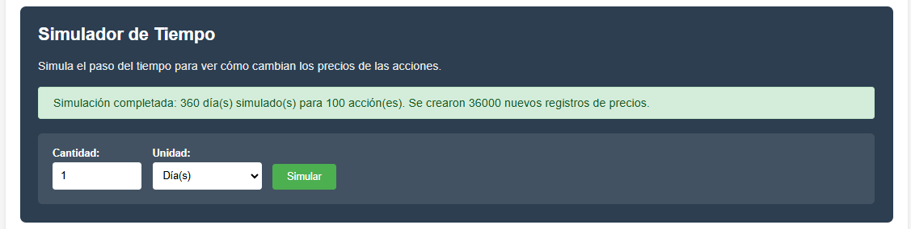
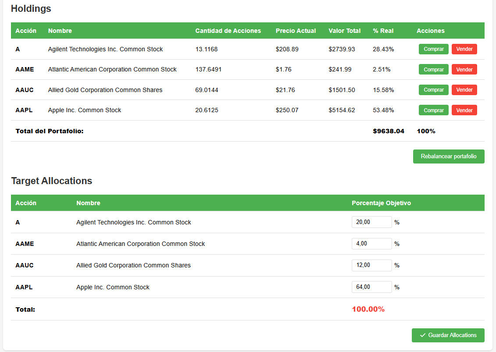
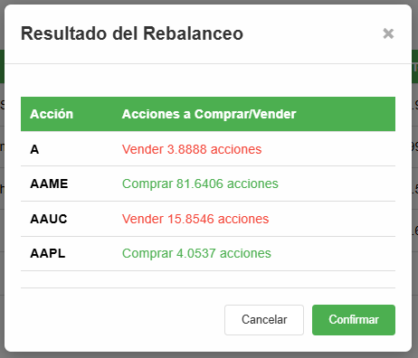
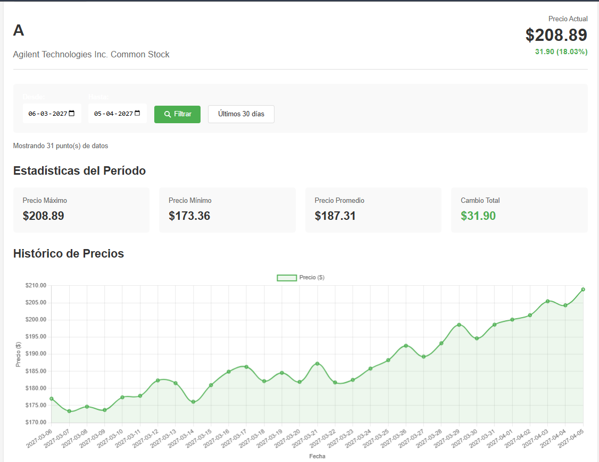

# 🚀 Learning by Building

## Contexto

Estaba revisando lo que Fintual espera de un Software Engineer y me encontré que utilizan varias tecnologias en su stack. Programo desde los 16 años y trabajo como desarrollador fullstack desde 2020, así que en general me siento cómodo aprendiendo y moviéndome entre tecnologías. Aun así, había dos que no había usado directamente: Django y Go.

Dado que me gustan los desafíos prácticos y aprender por amor al arte, decidí hacer la tarea con Django.

> [!IMPORTANT]  
> Ahora que terminé el proyecto, noté que usar HTML + CSS era un poco más tedioso de lo que esperaba (normalmente uso React + Tailwind CSS + TypeScript), por lo que utilicé Claude para ayudarme a generar el frontend.

## ¿Por qué Django?

Luego de revisar los pros y contras entre Django y Go para un proyecto de aprendizaje, me decidí por Django, principalmente porque:

- Cuenta con muchas funcionalidades built-in (ORM, admin, auth, routing)
- Es facil montar algo funcional rápidamente
- Python se me da muy bien

## Supuestos

- Asumimos que las stocks cambian de precio por dia con una volatilidad entre 1% y 3%

## Estructura

```bash
portafolio/app/
├── models.py          # Modelos de Django
├── services.py        # Lógica
├── views.py           # Controladores
└── ...
```

## ¿Como funciona?

## Clases

- `PortfolioService`: Contiene la lógica principal para manejar portafolios, holdings y rebalanceo de portafolios.
- `StockTransactionService`: Maneja la lógica de compra y venta de acciones dentro de un portafolio.
- `StockDataService`: Provee datos de precios históricos y actuales de las acciones.

Para este problema, nos centramos en la clase `PortfolioService`, en los métodos `get_info_to_rebalance_portafolio` y `rebalance_portafolio`.

**Revisar `portafolio/app/services.py` para más detalles**

### Seeds

Es importante correr los seeds para crear usuarios, stocks y portafolios de prueba.

```bash
cd portafolio
rm db.sqlite3

python3 manage.py runserver

python3 manage.py migrate
python3 manage.py seed_users
python3 manage.py seed_stocks
python3 manage.py seed_portfolios
```

> [!TIP]
> Para agregar más stocks, edita el archivo `portafolio/app/management/commands/seed_stocks.py`, linea 25

Una vez corridos los seeds, podemos probar la aplicación

### Caso de ejemplo

Consideremos el siguiente ejemplo:

- Usuario crea un portafolio con $10,000 (dia 0) y agrega stocks a su portafolio
- Usuario cuenta con los siguientes Holdings y Allocations:



- Se simula el paso de 90 dias, donde cada dia las stocks cambian de precio con una volatilidad entre 1% y 3%



- Verificamos que las stocks se han ajustado a las nuevas condiciones de mercado



- Ahora realizamos un balanceo de portafolio, según los target definidos. Se abre la pestaña de confirmación



- Verificamos que el portafolio se ha ajustado a los nuevos target definidos



- Ahora realizamos una simulación de 12 meses



- Verificamos que las stocks se han ajustado a las nuevas condiciones de mercado y con ello el porcentaje de cada stock en el portafolio



- Volvemos a balancear el portafolio



- Podemos verificar como afectó el paso del tiempo a las acciones seleccionando cualquiera de ellas



- Verificamos que el portafolio se ha ajustado a los nuevos target definidos


## Bibliografía

- [GPT - Redacción](https://chatgpt.com/share/695dcf6c-6b3c-8012-bcec-95e58e7362a2)
- [YouTube - Django Tutorial](https://www.youtube.com/watch?v=nGIg40xs9e4)
- [Stocks](https://www.nasdaq.com/market-activity/stocks/screener)
- [GPT - Entendiendo el problema](https://chatgpt.com/share/695e501c-85e0-8012-8e05-ce6f096c717f)

## Comandos utiles

```bash
python3 manage.py makemigrations
python3 manage.py createsuperuser
```

## Datos de prueba

**Usuarios creados por seed_users:**

- Username: `admin1` | Password: `admin123` | Email: admin1@example.com
- Username: `admin2` | Password: `admin123` | Email: admin2@example.com

**Portafolios creados por seed_portfolios:**

- Se crea un portafolio para cada usuario existente con un balance inicial de $10,000